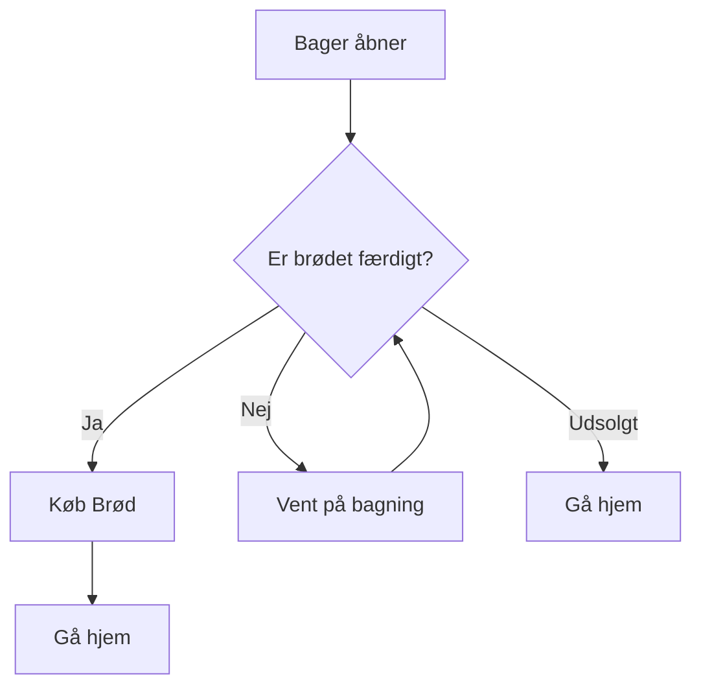
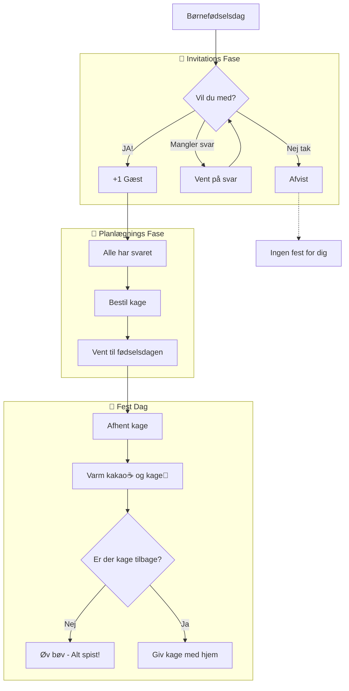

# Opgaver baseret på Niveauer
### Opgaverne stillet her er baseret på niveauer og stiger i sværhedsgraderne. Ligeledes er mængden af hjælp og dokumentation tilpasset niveauet af opgaven 
_________________

# N1
**Introduktions opgaver. Hovedsageligt  dokumentations-opgaver på ny løsning (PK) og små udviklingsopgaver**

## PK 
> I løsningen PK skal der være flere forskellige brugertyper.   Alle brugere går igennem nogle stadier der skal opnås, før de kan logge ind, søge opslag, eller lave en reservation.  
-----

## Klasse diagrammer
> Definer typer og aktivitet på platformen. Lav modeller eller diagrammer der viser:

#### 1) Brugerne og deres opslag
-  Indhold af en brugers profil:
    - Privatbruger
    - Virksomhedsbruger
- Listing Service Domæne Model: 
    - Listing (opslag)
    - Kategorier
    - TilgængelighedsSlot
    - ListingMedia (Billeder) 
- Media Service Domæne Model:
    - Medie metadata-entities
    - Upload processing
    - Storage abstraktions lag    

#### 2) Brugernes aktivitet imellem hinanden
- Booking Service Domæne Model:
    - Booking entity med status states
    - Booking-lister og booking-bruger relationships
    - Booking timlines og lifecycles 
- Betalings (Payment) Service Domæne Model:
    - Betalings-provider integration
    - Booking-Betalings forhold
- Besked (Messaging) Domæne Model: 
    - Besked og kommentar-Entities
    - Bruger-tråd forhold (Ejer/ Lejer)
    - Thread-Listing association (Tråd bundet til listing/ bruger)
- Notifikations Service Domæne Model:
    - Notifikations template
        - Event template
    - Notifikations-outbox til delivery-pipeline
    - Event-to-notification mapping

### Cross-reference
- API-gateway integration pattern:
    - Service discovery
    - Request/ response pipeline
- Event bus
    - Domæne events (ListingCreated, BookingConfirmed, PaymentCapture)
    - Event publishers og subscribers
    - Thread update (Review/ kommentar)
-  Common types:
    - Penge, Adresser, TlfNummer, Lokation (Alt der kan genbruges af andre services skal her ned)
    - Fælles Enums (Currency, Statustype)
    - Results/ Reponse patterns (Søgning= results, Approved, wait, declined (regler + actions))

### User Flow
> Bruger registrering, sikkerhed og  aktivitet. 
- Lav en model der viser registrering på PK som privat-bruger 
    - PK åbnes, personen trykker på opret bruger, tilføjer informationer, afslutter og bliver registreret 
- Lav en model der viser registrering på PK som virksomheds-bruger 
    - PK åbnes, personen trykker på virksomheds-bruger, tilføjer information, afslutter og bliver registreret
    - Skriv pseudo-kode for en brugeroprettelses-funktion
- Lav en model der viser Authentication og Authorization (Auth flow)
- Lav en model der viser kommunikation mellem brugere
    - Skriv pseudo-kode for en live-chat mellem verificeret brugere

-----

### Booking flow
> Lav modeller over følgende
- Flow af booking af en trailer
- Flow på at få lejet sin trailer ud

*Nedenunder ses en model for User Registration Flow Nedenunder er en model, der viser hvordan brugeren starter på start punktet og møder log-in/ registrerings muligheder.*

-----

### Data og Databaser
- Lav et diagram over DB (Bruger) og relation mellem bruger og opslag
- Lav en model over dataene i PK (alle typer og deres relationer)
     - Brug beskrivende sprog til at forklare hvad og hvordan. 

# N1 Scenarie: PK - Der skal lånes!
Lav modeller der viser: 
- En bruger (Lejer) er oprettet og logget ind
    - Brugeren søger efter en trailer
- En bruger (Udlejer) findes med to opslag
    - Opslag 1: En trailer -> Tilgængelig fra Nu til 31. December 2026 
    - Opslag 2: En trailer -> Tilgængelig fra om to dage - enhed er optaget
- Viser distance-funktionen når der søges efter en enhed
- Bruger Lejer sender anmodning til Udlejer, på opslag med tilgængelighed 
- Bruger Udlejer får en anmodning fra Lejer på Opslag 2
- Udlejer og Lejer laver en aftale (24t)
- Lejer leverer trailer tilbage, betaler, anmelder
    - Udlejer afslutter udlejning og bliver vurderet 
        - Enhed kommer tilbage som tilgængelig

----
Eksempel på hvordan scenariet kan vises med: Bager, Brød og Kunder.

-----
Et lidt mere involveret eksempel: 

_________________
# N2
> Introduktions opgaver + 10% 

## PantMig 

### Service Overview
> Lav dokumentation baseret på repository: https://github.com/Rosenorn-Solutions/PantmigService

> Hvad er det? Hvordan virker det? Lav en simpel forklaring  + model der viser hvad hver service gør, og hvordan servicene arbejder sammen. 

- Hvad er PantmigService?
- Hvad er AuthService? 
    - Beskriv authentication/authorization flow og krav
- Hvordan interagerer de med hinanden? 
    - Lav et simpelt diagram over interaktioner. 

### PantmigService dokumentation

- Lav en kort service-beskrivelse (formål, ansvar og scope)
- Beskriv høj-niveau arkitektur (lag, centrale moduler og afhængigheder)
- Kortlæg API-endpoints (input/output, statuskoder og fejlscenarier)
- Lav en “data-kontrakter” sektion for DTO’er (felter, krav, validering)
- Dokumentér centrale domæne-modeller og deres relationer
- Beskriv konfiguration (miljøvariabler, secrets og default-værdier)
- Notér baggrundsprocesser/hosted services (hvad de gør og hvornår de kører)
- Lav en “Getting Started” sektion (build, run, test og lokal opsætning)
- Lav en fejl- og supportsektion (typiske fejl, troubleshooting, logs)

### Service
- Lav en Service Overview Model, der viser high-level ansvar og funktioner for AuthService og PantmigService
     - Vis med model hvilke regler de skal følge
     - Bonus: Er der nogen åbne huller?
-----

### Messaging
- Lav en model der viser Real Time Messaging (message broker interactions)
     - Forklar forhold mellem publisher/ consumer
- Lav et sekvensdiagram for en besked fra client → broker → consumer
- List events/queues og hvad de bruges til
- Beskriv retries, dead-lettering og idempotency (hvad sker ved fejl?)
- Angiv krav til payloads (schema, versionering, størrelse)
-----

### Validation og File Handling
- Lav en model der viser hvordan File Validation fungerer ved upload
- Lav en model der viser Listing Validation og publication
- Dokumentér fil-typer, størrelsegrænser og sikkerhedstjek
- Beskriv virus-/malware-scan flow (hvis relevant) og fallback
- Beskriv hvor filer lagres (path/bucket), og hvordan adgang styres
- Lav en tjekliste for fejlhåndtering (hvad vises til bruger, hvad logges)
-----

### Handlinger
- Lav en liste over handlinger der laves, og hvilke relationer handlinger har til hinanden og løsningen

_________________

# N3
> Beskriv automatiske processer, og hvilken betydning de har for løsningernes funktionalitet

### Background jobs og Hosted Services
- UsernameGenerator og UserManagerExtensions
- IAuthService 
- Caching af data og top-level memory spaces
- ApplicationDbContext, ApplicationUser og RefreshToken
- IAuthService
- IEmailSender
_________________

# N4
> Programmering og modeller --> udvikles i React Native (crossplatform app)
- Jævnføre domæne entiteter
- Bestemme annotationer
- Jævnføre services (CRUD services)
- Jævnføre API-kontrakt --> Følg samme struktur som i Identity-service og listing service fundet i PK-repo (udviklet af Fnug)

_________________

# N5
> Uni-testing og performance analyse + forbedring (db, cashing, user experience) == Mindst 85% dækning. Leggo.
>> Pentesting (Skal ønkes - Kali opgaver)
- Dække servives og funktioner med:
    - Unit-test
    - Integrations-test
    - Emuleret app-test