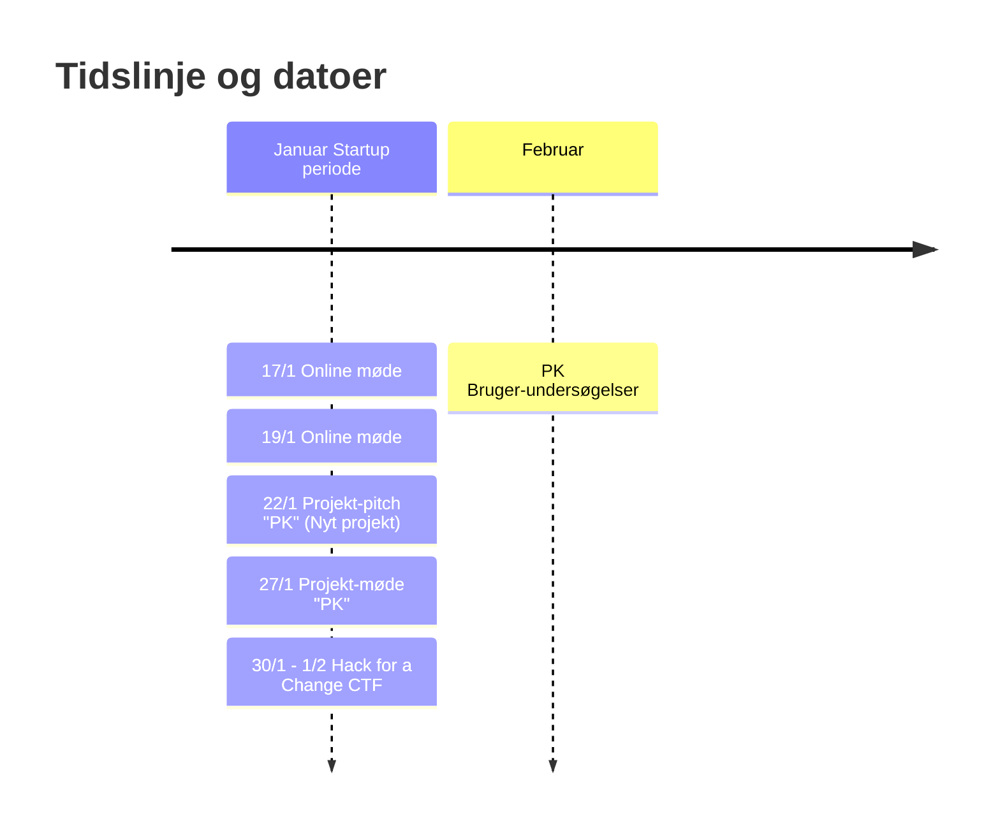

# Praktik_Opgaver_Jan
Opgaver specificeret til praktikanter 2026 hos RSolutions 

# Kalender 

## Specifikationer
> D. 19/1 - 23/1
>>- Beskrive og forklare hvordan PantMigService -> AuthService fungerer
>>    - Endpoints/ AuthEndpoints (Brugerne)
>>    - ApplicationDbContext, ApplicationUser og RefreshToken
>>    - IAuthService
>>    - IEmailSender
>>    - UserAccountService, UsernameGenerator og UserManagerExtensions

> D. 26/1 - 30/1
>> - Beskrive og forklare hvordan PantMig DB er sat op
>> - DB-typer og funktioner
>>      - Datatyper og struktur
>> - Modeller og regler

> D. 2/2 - 6/2
>> - Beskrive og forklare sammenhæng mellem DB og Brugeraktiviteter

## Bonus Opgaver
- D. 30/1 - 2/2 - Hack for a Change 2026 (https://ctftime.org/event/3083)

- Ethical Hacking Cisco course, 70 timer. (https://www.netacad.com/courses/ethical-hacker?courseLang=en-US)

## Standarder
For at kunne arbejde ud fra et IT-professionelt niveau, skal al dokumentation laves og deles som Markdown 
- Læs om: https://www.markdownguide.org/basic-syntax/

### Modeller 
**Modeller** til dokumentation
**UML**: 
- https://simplecode.dk/hvad-er-uml/
- https://www.geeksforgeeks.org/system-design/unified-modeling-language-uml-class-diagrams/

- Nedenunder viser UML diagrammerne vist i form af et Klasse Diagram

---------

**Usecase Diagram**

---------

**Flowchart**:
- https://da.itpedia.nl/2022/11/27/9-belangrijkste-flowchart-symbolen/

---------

**Userflow**

---------

**Activity Diagram**

---------

**Sekvensdiagram**: 
- https://sparxsystems.com/resources/tutorials/uml2/sequence-diagram.html

---------

**API Diagram**:
- https://www.lucidchart.com/blog/why-you-should-create-an-api-diagram

---------

**Deployment diagram**
- https://edrawmax.wondershare.com/templates/deployment-diagram-for-client-server.html

---------

**Værktøjer**
- Draw.io
- Mermaid 

